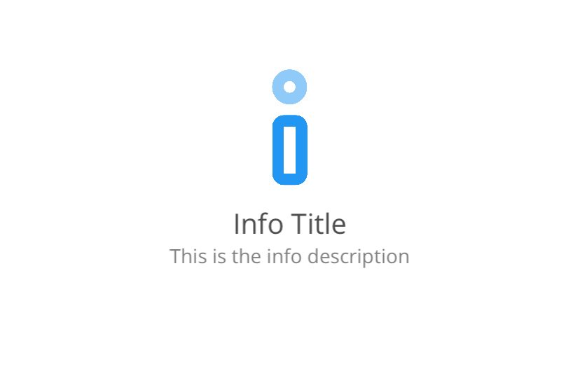
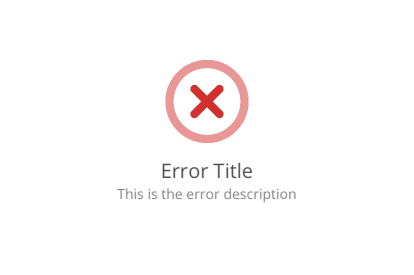
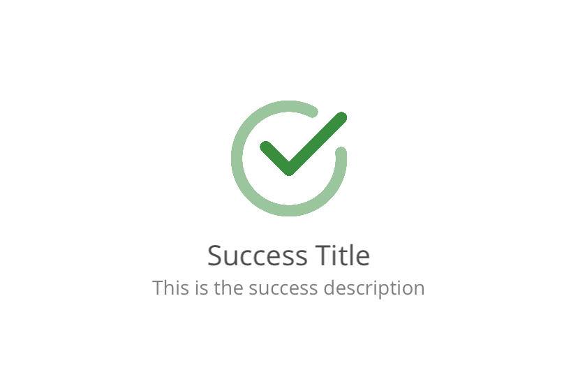
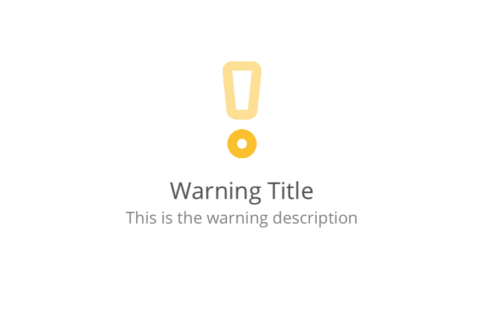

[EN](README.md) | ES

# Feedback

Feedback es una biblioteca de .NET MAUI que te permite mostrar mensajes de respuesta para procesos o tareas ejecutadas. Soporta diferentes tipos de feedback como error, información, éxito y advertencia. Puedes personalizar el título y la descripción, y utiliza animaciones para cuando los mensajes aparecen y desaparecen.

<div style="margin: 20px 0;">
  
</div>

## Características

- Mostrar mensajes de feedback para procesos o tareas
- Soporte para diferentes tipos de feedback: error, información, éxito y advertencia
- Título y descripción personalizables
- Animaciones para la aparición y desaparición de mensajes

## Instalación

Para instalar Feedback, ejecuta el siguiente comando en la Consola del Administrador de Paquetes NuGet:

```sh
Install-Package Feedback
```
## Versión

Versión actual: 1.0.0

## Iconos

Para usar los iconos de feedback, copia los iconos SVG de la carpeta `icons` a la carpeta `Resources\Images` de tu proyecto principal. Siéntete libre de modificar los iconos según tus necesidades.

<div style="margin: 20px 0;">
  
  
  
  
</div>

## Propiedades

<table style="border: 1px solid #4d4d4d50;">
  <tr style="font-weight: 900;background-color:#4d4d4d20;"><td>Propiedad</td><td>Descripción</td><td>Valor por defecto</td></tr>
  <tr><td style="font-weight: 600;">Size</td><td>Define el tamaño del control. Basado en este valor, se determina el tamaño del icono, título y descripción.</td><td>100</td></tr>
  <tr><td style="font-weight: 600;">Type</td><td>Determina el tipo de icono: error, información, éxito, advertencia.</td><td>info</td></tr>
  <tr><td style="font-weight: 600;">Title</td><td>El título del mensaje.</td><td>Cadena vacía</td></tr>
  <tr><td style="font-weight: 600;">Description</td><td>La descripción del mensaje.</td><td>Cadena vacía</td></tr>
  <tr><td style="font-weight: 600;">IsVisible</td><td>Determina la visibilidad del control.<td>false</td></tr>
</table>

## Uso

Primero, agrega el espacio de nombres a tu archivo XAML:

```xml
xmlns:feedback="clr-namespace:Feedback;assembly=Feedback"
```

Luego, puedes usar el control `Feedback` en tu XAML:

```xml
<feedback:Message
  Type="success"
  Title="Operación Completada"
  Description="La operación se completó con éxito."
  isVisible="True" />
```

También puedes establecer las propiedades programáticamente:

```csharp
var feedback = new Feedback.Message
{
  Type = FeedbackType.Success,
  Title = "Operación Completada",
  Description = "La operación se completó con éxito.",
  isVisible = true
};
```

## Tipos de Mensaje

- `Error`: Indica que ocurrió un error.
- `Info`: Proporciona mensajes informativos.
- `Success`: Indica una operación exitosa.
- `Warning`: Advierte sobre posibles problemas.

## Personalización

Puedes personalizar la apariencia y el comportamiento de los mensajes de feedback configurando varias propiedades:

- `Title`: El título del mensaje de feedback.
- `Description`: La descripción detallada del mensaje de feedback.

## Ejemplo

Aquí tienes un ejemplo de cómo usar la biblioteca Feedback en tu aplicación .NET MAUI:

```xml
<feedback:FeedbackControl
  Type="warning"
  Title="Batería Baja"
  Description="El nivel de tu batería está por debajo del 20%."
  isVisible="True" />
```
## Ejemplo

<div style="margin: 20px 0;">
  
</div>

## Licencia

Este proyecto está licenciado bajo la Licencia MIT.

## Contacto

Para cualquier pregunta o feedback, por favor contáctanos en [support@freakz.dev](mailto:support@freakz.dev).