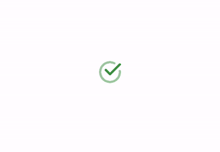
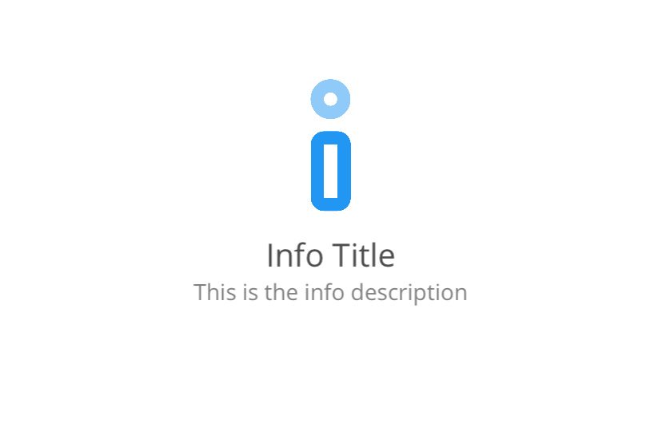
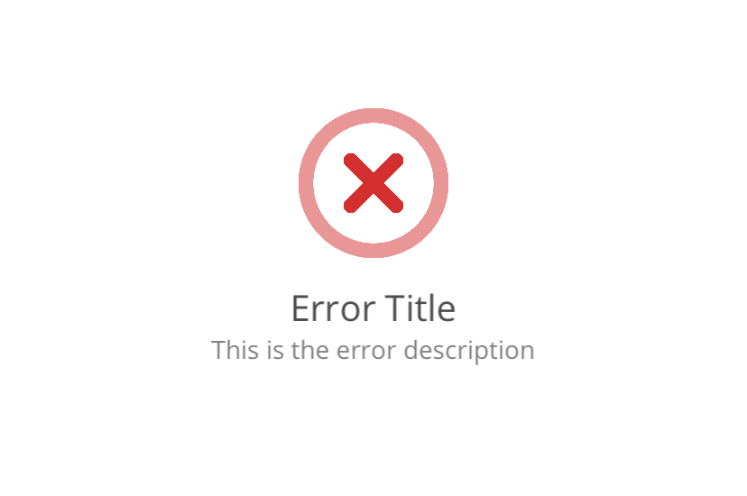
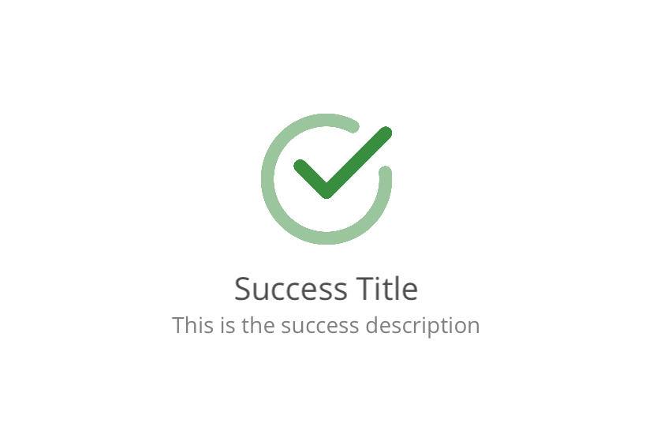
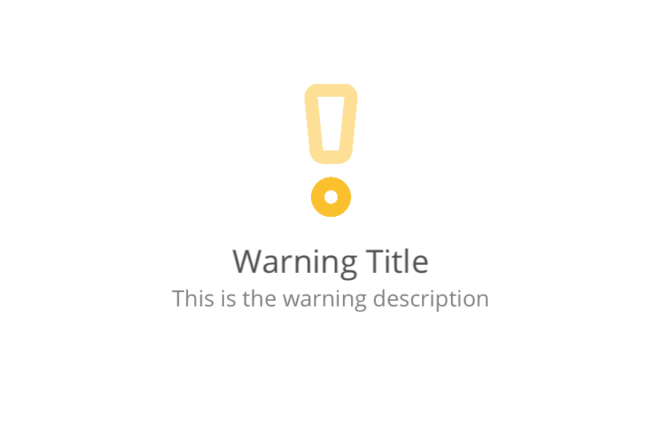
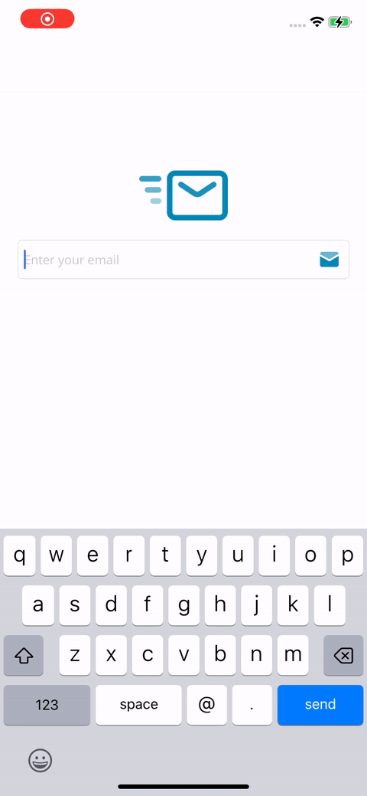

🇺🇸 EN | [🇪🇸 ES](README.es.md)

# Feedback

Feedback is a .NET MAUI library that allows you to display response messages for executed processes or tasks. It supports different types of feedback such as error, info, success, and warning. You can customize the title and description, and it uses animations for when the messages appear and disappear.

<div style="margin: 20px 0;">
    
</div>

## Features

- Display feedback messages for processes or tasks
- Support for different feedback types: error, info, success, and warning
- Customizable title and description
- Animations for appearing and disappearing messages

## Installation

To install Feedback, run the following command in the NuGet Package Manager Console:

```sh
dotnet add package FreakzDEV.Feedback --version 1.0.2
```
## Version

Current version: 1.0.2

## Icons

To use the feedback icons, copy the SVG icons from the `icons` folder to the `Resources\Images` folder of your main project. Feel free to modify the icons to suit your needs.

<div style="margin: 20px 0;">
    
    
    
    
</div>

## Properties

<table style="border: 1px solid #4d4d4d50;">
    <tr style="font-weight: 900;background-color:#4d4d4d20;"><td>Property</td><td>Description</td><td>Default Value</td></tr>
    <tr><td style="font-weight: 600;">Size</td><td>Defines the size of the control. Based on this value, the size of the icon, title, and description is determined.</td><td>100</td></tr>
    <tr><td style="font-weight: 600;">Type</td><td>Determines the type of icon: error, info, success, warning.</td><td>info</td></tr>
    <tr><td style="font-weight: 600;">Title</td><td>The title of the message.</td><td>Empty string</td></tr>
    <tr><td style="font-weight: 600;">Description</td><td>The description of the message.</td><td>Empty string</td></tr>
    <tr><td style="font-weight: 600;">IsVisible</td><td>Determines the visibility of the control.<td>false</td></tr>
</table>

## Usage

First, add the namespace to your XAML file:

```xml
xmlns:feedback="clr-namespace:FreakzDEV.Feedback;assembly=FreakzDEV.Feedback"
```

Then, you can use the `Feedback` control in your XAML:

```xml
<feedback:Message
  Type="success"
  Title="Operation Completed"
  Description="The operation was completed successfully."
  isVidible="True" />
```

You can also set the properties programmatically:

```csharp
var feedback = new Feedback.Message
{
  Type = FeedbackType.Success,
  Title = "Operation Completed",
  Description = "The operation was completed successfully.",
  isVisible = true
};
```

## Message Types

- `Error`: Indicates an error occurred.
- `Info`: Provides informational messages.
- `Success`: Indicates a successful operation.
- `Warning`: Warns about potential issues.

## Customization

You can customize the appearance and behavior of the feedback messages by setting various properties:

- `Title`: The title of the feedback message.
- `Description`: The detailed description of the feedback message.

## Example

Here is an example of how to use the Feedback library in your .NET MAUI application:

```xml
<feedback:FeedbackControl
  Type="warning"
  Title="Low Battery"
  Description="Your battery level is below 20%."
  isVidible="True" />
```
## Sample

<div style="margin: 20px 0;">
    
</div>

## License

This project is licensed under the MIT License.

## Contact

For any questions or feedback, please contact us at [support@freakz.dev](mailto:support@freakz.dev).
